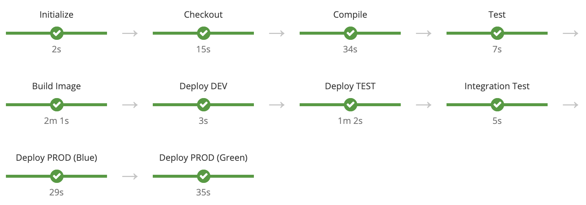

# OpenShift CI/CD Demo

Demonstration of OpenShift CI/CD pipelines for deploying applications accross environments using advanced deployment strategies like Blue/Green.

## Goals

* Unique parametrized Jenkinsfile which allows organizations to ensure control of its building and promotion process
* Pipelines created by developers using templates in a self service way
* S2I build strategy for better security, organizations could control the base images used for builds
* Convention over configuration whenever possible
* Git as the source of truth
* Advanced deployment strategies (Blue/Green)
* Complex integration testing scenarios

## Pipeline

## Usage

The template provided in this repository (for Java applications) is used to create a pipeline which in turns creates the application based on another template provided in the application repository alongside environment specific parameters.

More templates for other technologies could be created in the same fashion.

For this demonstration the application [openshift-hello-world](https://github.com/leandroberetta/openshift-hello-world) will be used as an example.

### Convertion over configuration

In the application repository a directory called openshift is needed where the template, build commands, environment specific configuration and the integration tests will be stored.

The applications needs to follow an specific structure.

    └── openshift
        └── template.yaml (1)
        └── dev
            └── templateParameters.txt (2)
            └── commands
                └── compile.sh (3)
                └── test.sh (4)
        └── test
            └── templateParameters.txt (5)
            └── integration-test 
                └── integration-test-agent.yaml (6)
                └── integration-test-entrypoint.sh (7)
                └── ...
        └── prod
            └── templateParameters.txt (8)

1. A template file that compose the application, this template will be applied each time the pipeline is executed in each environment, ensuring the promotion of all the resources in all environments, custom parameters are allowed but the parameter PARAM_APPLICATION is mandatory (represents the name of the resources of the application).
2. The parameters to populate the template for the DEV environment.
3. The commands to compile the application. The binaries to upload into the S2I binary process must reside in the artifact-dir directory.
4. The commands to test the application.
5. The parameters to populate the template for the TEST environment.
6. The YAML representation of a Jenkins agent where the integration tests will run, multiple containers could be defined.
7. An entry point for the integration tests.
8. The parameters to populate the template for the PROD environment.

### Notes

* The image creation process involves a S2I binary build so the artifacts generated by the compile commands needs to be uploaded when starting the image build, the pipeline will upload a directory named artifact-dir. In the compile.sh script this directory needs to be created and populated with the artifacts. If the technology does not required to be compiled, as for example Python, copy all the code needed to the directory and will be upload it for the base image to use it.
* The templates needs to define a environment variable named JENKINS_AGENT in the BuildConfig (pipeline) to set the Jenkins agent where the pipeline will run, in the case of the Java template, this variable is set to maven.

## Pipeline Library

The pipelines use a shared library for common functionality, the code is in the following repository:

* [openshift-pipeline-library](https://github.com/redhatcsargentina/openshift-pipeline-library.git)

## Demo

### Import the template

The template could be created in the openshift project.

    oc create -f templates/java-pipeline.yaml -n openshift

### Create the environments (projects)

These are the environments where the applications will be promoted by the pipeline.

    oc new-project hello-world-dev
    oc new-project hello-world-test
    oc new-project hello-world-prod
    
### Create a Jenkins instance

A Jenkins instances will be created in the development project.

    oc new-app --template=jenkins-ephemeral --name=jenkins -n hello-world-dev

Then a set of permissions need to be granted.

    oc adm policy add-role-to-user edit system:serviceaccount:hello-world-dev:jenkins -n hello-world-test
    oc adm policy add-role-to-user edit system:serviceaccount:hello-world-dev:jenkins -n hello-world-prod

### Create the pipeline

The next step is create the pipeline based on the templates (in this case the Java template will be used). This could be done in the OpenShift Web Console in the catalog.

    oc new-app --template java-pipeline -p PARAM_GIT_REPO=https://github.com/redhatcsargentina/openshift-hello-world.git -p PARAM_GIT_BRANCH=master -p PARAM_APP=hello-world -n hello-world-dev

### Start the pipeline

Finally the pipeline is started.  

    oc start-build hello-world-pipeline -n hello-world-dev

